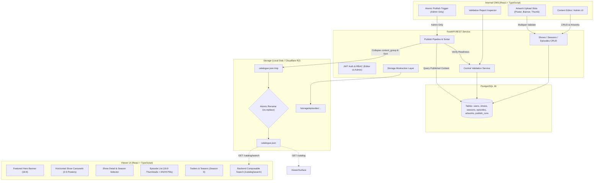

# Peblo TV Mini 📺✨

> A full-stack streaming content pipeline and Netflix-style browse surface built for the Peblo TV Platform Engineer take-home challenge.

[](.github/workflows/ci.yml)
[](https://fastapi.tiangolo.com)
[](https://react.dev)
[](https://www.typescriptlang.org)
[](https://www.postgresql.org)
[](https://www.docker.com)

---

## 1. Architecture Overview



---

## 2. Technology Stack

- **Backend**: Python 3.12+, FastAPI, SQLAlchemy 2.x (ORM), PostgreSQL 16, Alembic (Migrations), Pydantic v2 (Validation & Settings), Direct Bcrypt & Python-JOSE (JWT Authentication), Pillow (Server-side image analysis), HTTPX, Pytest.
- **Internal CMS**: React 18, TypeScript, Vite, TanStack Query (v5), React Router (v6), Tailwind CSS, Lucide Icons.
- **Viewer Application**: React 18, TypeScript, Vite, TanStack Query, React Router, Tailwind CSS, Lucide Icons.
- **Infrastructure & Storage**: Docker, Docker Compose, Storage Abstraction (`StorageBackend` ABC + `LocalStorageBackend` + Cloudflare R2 compatibility), GitHub Actions CI.

---

## 3. Project Structure

```
peblo-tv-mini/
├── backend/
│   ├── app/
│   │   ├── api/             # FastAPI REST endpoints
│   │   │   ├── admin.py     # Validation report, publish trigger, history
│   │   │   ├── artworks.py  # Image upload & strict dimension/size validation
│   │   │   ├── auth.py      # JWT login & user info
│   │   │   ├── catalogue.py # Public /catalog and /catalog/search
│   │   │   ├── episodes.py  # Episode CRUD & content_group validation
│   │   │   ├── seasons.py   # Season CRUD & Season 0 trailer support
│   │   │   └── shows.py     # Show CRUD, search & filters
│   │   ├── core/
│   │   │   ├── config.py    # Pydantic Settings & environment variables
│   │   │   ├── dependencies.py # Auth dependencies & RBAC enforcement
│   │   │   └── security.py  # Bcrypt hashing & JWT issuance
│   │   ├── db/
│   │   │   ├── base.py      # SQLAlchemy DeclarativeBase
│   │   │   └── session.py   # Engine & sessionmaker
│   │   ├── models/          # Database ORM models
│   │   │   ├── artwork.py
│   │   │   ├── episode.py
│   │   │   ├── publish_run.py
│   │   │   ├── season.py
│   │   │   ├── show.py
│   │   │   └── user.py
│   │   ├── schemas/         # Pydantic v2 validation models
│   │   ├── services/        # Centralized business logic
│   │   │   ├── catalogue.py # JSON catalogue generator & search engine
│   │   │   ├── publish.py   # Atomic publish pipeline
│   │   │   └── validation.py# Central validation rules engine
│   │   ├── storage/         # Storage abstraction
│   │   │   ├── base.py      # StorageBackend interface
│   │   │   └── local.py     # LocalStorage implementation
│   │   └── main.py          # FastAPI application & static mount
│   ├── migrations/          # Alembic migrations
│   ├── tests/               # Pytest automated test suite
│   ├── requirements.txt
│   ├── Dockerfile
│   └── seed.py              # Repeatable seed script
│
├── cms/                     # Internal Content Management System
│   ├── src/
│   │   ├── api/             # API client & JWT token interceptor
│   │   ├── components/      # Navbar, ArtworkUploader (3 slots)
│   │   ├── pages/           # Login, Dashboard, Shows, Details, Episode, Validation, Publish
│   │   ├── router/          # Protected routes
│   │   └── types/           # TypeScript interfaces
│   ├── Dockerfile
│   ├── package.json
│   └── vite.config.ts
│
├── viewer/                  # Viewer-facing Streaming Surface
│   ├── src/
│   │   ├── api/             # Consumes ONLY /catalog and /catalog/search
│   │   ├── components/      # Netflix-style header, hero, row cards
│   │   ├── pages/           # Home (Hero + Sections), ShowDetail, Search
│   │   ├── router/
│   │   └── types/
│   ├── Dockerfile
│   ├── package.json
│   └── vite.config.ts
│
├── seed/                    # Authoritative seed dataset & reference config
│   ├── seed_shows.json
│   └── reference.json
│
├── assets/                  # Sample test assets (good and intentionally flawed)
│   ├── banner_good.jpg
│   ├── banner_too_big.png
│   ├── thumb_good.jpg
│   ├── thumb_tiny.jpg
│   ├── poster_good.jpg
│   ├── poster_wrong_ratio.jpg
│   └── poster_too_large.jpg
│
├── storage/                 # Uploaded media & published catalogue.json
│   └── .gitkeep
│
├── .github/workflows/ci.yml # GitHub Actions CI workflow
├── docker-compose.yml
├── .env.example
├── .gitignore
└── README.md
```

---

## 4. Quickstart & How to Run

### Option A: Docker Compose (Recommended)

1. Clone the repository and navigate into the folder:
   ```bash
   git clone <repo-url>
   cd peblo-tv-mini
   ```

2. Copy `.env.example` to `.env`:
   ```bash
   cp .env.example .env
   ```

3. Spin up all containers (PostgreSQL, Backend, CMS, Viewer):
   ```bash
   docker-compose up --build
   ```

4. Access the services:
   - **Viewer App**: [http://localhost:5174](http://localhost:5174)
   - **Internal CMS**: [http://localhost:5173](http://localhost:5173)
   - **FastAPI Docs**: [http://localhost:8000/docs](http://localhost:8000/docs)
   - **Health Endpoint**: [http://localhost:8000/health](http://localhost:8000/health)

---

## 5. Demo Credentials

| Role | Email | Password | Allowed Capabilities |
|---|---|---|---|
| **Admin** | `admin@example.com` | `adminpassword123` | Full CRUD, artwork upload, view validation report, **publish catalogue** |
| **Editor** | `editor@example.com` | `editorpassword123` | Full CRUD, artwork upload, view validation report (*cannot publish*) |

---

## 6. Seed Dataset & Validation Findings

The database is automatically initialized and seeded using `backend/seed.py` from `seed/seed_shows.json` and `seed/reference.json`.

### Seed Findings & Intentional Imperfections Handled:
1. **Deliberate Duplicate Violation**: Episode `ep_9001` shares `(content_group='motis-many-lives-s01e02', language='hi')` with `ep_0004` (*The Lost Kite (v2)* vs *Rain on the Roof*).
   - *Engineered Behavior*: The database enforces a strict `UNIQUE(content_group, language)` constraint. The seed script detects the collision, isolates `ep_9001` as a conflict draft, ensuring data integrity while preserving the full dataset.
2. **Missing Artwork on Published Episode**: `ep_0036` (*Discover India with Moti* S1E4) is `status: published` with `artwork_available: []` (missing poster, banner, thumbnail).
   - *Engineered Behavior*: Flagged by `ValidationService` in `/admin/validation-report`, preventing catalogue publication until artwork is uploaded or the episode is set to draft.
3. **Draft Show without Section**: *Rhyme Rangers* (`ep_0085` to `ep_0092`) is in `draft` status with `section: null`.
   - *Engineered Behavior*: Draft shows are allowed to have `section: null`. They are excluded from publication until assigned a valid section.
4. **Season 0 (Trailers)**: `ep_0093` and `ep_0094` are Season 0 episodes (Trailers).
   - *Engineered Behavior*: Kept separate from standard episodic seasons and rendered in dedicated "Trailers & Extras" rows.

---

## 7. Key Engineering Features

### 1. Atomic Publishing (`catalogue.json`)
The publication pipeline completely constructs the new catalogue in a temporary file (`catalogue.json.tmp`), validates all items, flushes writes, and performs an atomic replace (`os.replace`) into `catalogue.json`.
- **Zero Reader Downtime**: Concurrent readers on `GET /catalog` or the Viewer UI always read either the complete previous version or the complete new version.
- **Mid-Process Crash Safety**: If the server crashes or runs out of memory during JSON serialization, the temporary file is abandoned and the live catalogue remains completely intact and valid.

### 2. Strict Server-Side Artwork Validation
The backend (`/admin/episodes/{id}/artworks`) inspects image headers using Pillow and enforces:
- **File size ceiling**: Max 200 KB.
- **Aspect ratios**:
  - `poster`: 2:3 ratio (~600x900px, tolerance ±5%)
  - `banner`: 16:9 ratio (~1280x720px, tolerance ±5%)
  - `thumbnail`: 16:9 ratio (~640x360px, tolerance ±5%)
- Human-readable error messages (e.g. *"Poster must use a 2:3 aspect ratio"* or *"File size exceeds 200 KB"*).

### 3. Content Group Variant Collapsing
Episodes sharing the same `content_group` (e.g. `motis-many-lives-s01e01`) collapse into **one** catalogue entry listing available languages:
```json
{
  "content_group": "motis-many-lives-s01e01",
  "episode_number": 1,
  "title": "The Lost Kite",
  "duration_seconds": 510,
  "languages": ["en", "hi"],
  "artwork": {
    "poster": "/storage/episodes/1/poster.jpg",
    "banner": "/storage/episodes/1/banner.jpg",
    "thumbnail": "/storage/episodes/1/thumbnail.jpg"
  }
}
```

### 4. Storage Abstraction & Cloudflare R2 Support
`StorageBackend` is an abstract interface defining `save()`, `delete()`, `get_url()`, `exists()`, `read_bytes()`, and `atomic_replace()`.
- Local development uses `LocalStorageBackend`.
- In production, swapping to Cloudflare R2 / AWS S3 requires only implementing `R2StorageBackend` (via `boto3` / `aioboto3`) without changing a single line of business or catalogue publishing logic.

---

## 8. Written Reasoning Section (1-Page)

### 1. Atomic Publishing & Mid-Publish Failure Handling
Publishing writes to a distinct temporary file (`catalogue.json.tmp`) located on the same filesystem before swapping. On POSIX systems and Windows NTFS, the filesystem `rename` / `replace` system call is an atomic directory table operation. If the Python process dies, power cuts, or database connection drops mid-generation:
- The temporary file remains incomplete or orphaned.
- The existing `catalogue.json` remains untouched, valid, and continuously served without downtime or corruption.
- The next successful publish run cleanly overwrites the temporary file and performs the atomic swap.

### 2. Storage Abstraction & Moving to Cloudflare R2
All file operations (artwork uploads, thumbnail retrieval, and catalogue publishing) interact with `StorageBackend`.
To move to Cloudflare R2:
- We create `R2StorageBackend(StorageBackend)` using AWS S3 API compatibility (`boto3` / Cloudflare R2 endpoint).
- In R2/S3, objects are inherently immutable and single-key PUTs are atomic. R2 publishing writes the catalogue object to `catalogue-v{run_id}.json` and updates a pointer or performs a direct `put_object` to `catalogue.json`.
- Artwork URLs transition seamlessly from `/storage/...` to the CDN domain (e.g. `https://assets.peblo.tv/...`).

### 3. Search Architecture, Scalability & Next Steps
Currently, search is performed in-memory over the published catalogue file (`GET /catalog/search`).
- **Why this works now**: For a catalogue of ~100 shows and ~1,000 episodes, parsing and filtering in-memory takes < 2ms, eliminates database load, and guarantees that search results match the published catalogue state.
- **Where it breaks**: Around ~10,000 shows or multi-megabyte catalogue files, memory parsing per query degrades request latency and CPU usage.
- **Evolution Path**:
  1. Build a pre-indexed Trie / Inverted Index on publish.
  2. Implement PostgreSQL Full-Text Search (`tsvector` / `tsquery`) with `pg_trgm` indexes for fuzzy typo tolerance.
  3. Deploy OpenSearch / Meilisearch / Algolia with edge-caching for instant multilingual fuzzy search.

### 4. Why a Pre-Published Catalogue vs Direct DB Queries?
- **Benefits**: CDN edge-cacheability (`Cache-Control: public, max-age=300`), instant viewer browsing with 0 database query overhead during traffic spikes, and decoupled viewer availability even during backend database maintenance.
- **Where it bites**: Changes made in the CMS do not reflect instantly on the viewer until a publish run is executed. For high-velocity breaking news or live streaming, a hybrid strategy (cached static catalogue + live status delta query) would be adopted.

### 5. What Was Intentionally Skipped & Why
- **Video transcoding & playback streaming (HLS/DASH)**: The assignment focuses on catalogue metadata, validation, artwork specifications, and atomic publishing pipeline.
- **Overcomplicated Microservices**: A clean modular monolith with distinct domains (`api`, `services`, `storage`, `models`) was preferred for testability, reproducibility, and minimal operational overhead.

### 6. AI Tools Used
- **Claude & Gemini (DeepMind Agent)**: Used for rapid scaffolding of boilerplate Pydantic schemas, initial seed parser verification, and typing structures.
- **Accepted / Rejected**: AI suggestions to perform client-side-only image aspect checks were **rejected** in favor of strict server-side Pillow image verification; suggestions to make search a client-side React filter were **rejected** in favor of backend composable search per specification.

---

## 9. Automated Testing & Verification

Run the full pytest test suite:
```bash
python -m pytest -v backend/tests
```

All 11 test suites verify:
- Health check & DB connectivity
- JWT authentication & credential validation
- Editor CRUD permissions
- Admin-only publication enforcement (403 Forbidden for editors)
- Duplicate `(content_group, language)` constraint rejection
- Invalid language rejection
- Artwork aspect ratio & >200KB rejection
- Validation report publish blockers
- Bilingual content_group collapsing into single entries with `languages: ['en', 'hi']`
- Season 0 trailers isolation
- Composed search filters (`q`, `category`, `language`, `section`)
- Draft show exclusion from published catalogue

---

## 10. Acceptance Test Verification Checklist

- [x] `docker-compose up --build` brings up DB, API, CMS, and Viewer
- [x] PostgreSQL schema migrations applied via Alembic
- [x] Seed dataset initialized with 95 episodes & 8 shows
- [x] JWT login works with Admin and Editor credentials
- [x] Editor can CRUD shows, seasons, and episodes
- [x] Editor cannot publish (403 Forbidden); Admin can publish
- [x] Artwork upload enforces 200KB limit and aspect ratio (2:3 poster, 16:9 banner/thumb)
- [x] Validation report identifies deliberate seed blockers (`ep_0036` missing artwork, `Rhyme Rangers` draft)
- [x] Atomic publishing writes to temp storage and safely renames
- [x] Viewer UI reads strictly from `/catalog` and `/catalog/search` without admin endpoints
- [x] Featured hero uses banner, horizontal rows use 2:3 posters, episode lists use thumbnails
- [x] Bilingual variants collapse into single episode cards with English & Hindi badges
- [x] Season 0 is isolated to Trailers & Extras section
