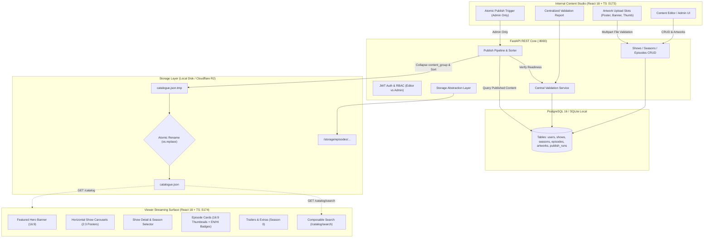

# Peblo TV Mini 📺✨

> A production-grade streaming content management pipeline and Netflix-style browse surface built for the **Peblo TV Platform Engineer Challenge**.

[](https://github.com/vyankateshwarpund/peblo-tv-mini/actions/workflows/ci.yml)
[](https://fastapi.tiangolo.com)
[](https://react.dev)
[](https://www.typescriptlang.org)
[](https://www.postgresql.org)
[](https://www.docker.com)
[](backend/tests)
[](backend)

---

## 1. System Architecture



---

## 2. Technology Stack

| Layer | Technology | Key Libraries & Purpose |
|---|---|---|
| **Backend Core** | Python 3.12+, FastAPI | SQLAlchemy 2.0 (ORM), Alembic (Migrations), Pydantic v2 (Settings & Schemas), Uvicorn |
| **Security & Auth** | JWT & Bcrypt | Direct Bcrypt hashing, Python-JOSE (HS256 tokens), Role-Based Access Control (`editor` / `admin`) |
| **Media Processing** | Pillow (PIL) | Server-side image inspection (200 KB ceiling, 2:3 & 16:9 aspect ratios) |
| **Database** | PostgreSQL 16 / SQLite | Relational schema with strict `UNIQUE(content_group, language)` DB constraints |
| **Internal CMS** | React 18, TypeScript, Vite | TanStack Query v5, Tailwind CSS, Lucide Icons, Axios API interceptors |
| **Viewer Surface** | React 18, TypeScript, Vite | Netflix-style dark layout, dynamic search/filter bar, theater video player modal |
| **Infrastructure** | Docker & GitHub Actions | Multi-stage Dockerfiles, Docker Compose, GitHub Actions CI (Lint, Test, Docker validation) |

---

## 3. Project Structure

```
peblo-tv-mini/
├── backend/
│   ├── app/
│   │   ├── api/             # REST endpoints
│   │   │   ├── admin.py     # Validation report, publish trigger, publish history
│   │   │   ├── artworks.py  # Image upload & strict dimension/size validation
│   │   │   ├── auth.py      # JWT authentication & user profile
│   │   │   ├── catalogue.py # Public /catalog and /catalog/search endpoints
│   │   │   ├── episodes.py  # Episode CRUD & uniqueness validation
│   │   │   ├── seasons.py   # Season CRUD & Season 0 trailer support
│   │   │   └── shows.py     # Show CRUD, search & section filtering
│   │   ├── core/
│   │   │   ├── config.py    # Pydantic Settings & environment variables
│   │   │   ├── dependencies.py # Auth dependencies & RBAC enforcement
│   │   │   └── security.py  # Password hashing & JWT token issuance
│   │   ├── db/
│   │   │   ├── base.py      # SQLAlchemy DeclarativeBase
│   │   │   └── session.py   # Database engine & sessionmaker
│   │   ├── models/          # Relational ORM models
│   │   │   ├── artwork.py
│   │   │   ├── episode.py
│   │   │   ├── publish_run.py
│   │   │   ├── season.py
│   │   │   ├── show.py
│   │   │   └── user.py
│   │   ├── schemas/         # Pydantic validation & response models
│   │   ├── services/        # Centralized business logic
│   │   │   ├── catalogue.py # JSON catalogue generator & search engine
│   │   │   ├── publish.py   # Atomic publish pipeline
│   │   │   └── validation.py# Central validation rules engine
│   │   ├── storage/         # Storage abstraction (Local disk / Cloudflare R2)
│   │   │   ├── base.py      # StorageBackend interface
│   │   │   └── local.py     # LocalStorageBackend implementation
│   │   └── main.py          # FastAPI application & static mount
│   ├── migrations/          # Alembic database migrations
│   ├── tests/               # Pytest automated test suite (11/11 passing)
│   ├── requirements.txt     # Python backend dependencies
│   ├── Dockerfile           # Multi-stage production container
│   └── seed.py              # Repeatable idempotent seed script
│
├── cms/                     # Internal Content Management System
│   ├── src/
│   │   ├── api/             # API client & JWT token interceptor
│   │   ├── components/      # Navbar, ArtworkUploader (3 slots), modals
│   │   ├── pages/           # Dashboard, Shows, Details, Episode, Validation, Publish
│   │   └── types/           # TypeScript interfaces
│   ├── Dockerfile
│   └── package.json
│
├── viewer/                  # Viewer-facing Streaming App (Netflix UI)
│   ├── src/
│   │   ├── api/             # Consumes ONLY /catalog and /catalog/search
│   │   ├── components/      # Netflix header, hero banner, show rows, player modal
│   │   ├── context/         # AuthContext with reactive profile state
│   │   ├── pages/           # Home, Browse/Search, ShowDetail, Profile, AuthGate
│   │   └── types/           # TypeScript interfaces
│   ├── Dockerfile
│   └── package.json
│
├── seed/                    # Seed dataset & reference configuration
│   ├── seed_shows.json      # 95 episode records across 8 shows
│   └── reference.json       # Allowed sections, categories, languages & artwork specs
│
├── storage/                 # Uploaded media & published catalogue.json
│   ├── episodes/            # Structured artwork storage by episode ID
│   └── catalogue.json       # Live atomic published catalogue
│
├── .github/workflows/ci.yml # GitHub Actions CI workflow
├── docker-compose.yml       # 4-service Docker orchestration
├── pyproject.toml           # Ruff & Pytest configuration
├── .env.example             # Clean environment variables template
├── .gitignore               # Comprehensive 7-section ignore rules
└── README.md
```

---

## 4. Quickstart & Running Instructions

### Option A: Run with Docker Compose (Recommended)

```bash
# 1. Clone repository
git clone https://github.com/vyankateshwarpund/peblo-tv-mini.git
cd peblo-tv-mini

# 2. Copy environment template
cp .env.example .env

# 3. Start all 4 containers (Postgres, Backend, CMS, Viewer)
docker-compose up --build
```

---

### Option B: Run Locally in VS Code (Native)

#### Terminal 1 — Backend (FastAPI)
```bash
cd backend

# Run database migrations
python -m alembic upgrade head

# Seed database with sample shows and users
python seed.py

# Start FastAPI server
cd ..
python -m uvicorn backend.app.main:app --host 0.0.0.0 --port 8000 --reload
```

#### Terminal 2 — Internal CMS Content Studio
```bash
cd cms
npm install
npm run dev
```

#### Terminal 3 — Viewer Streaming Application
```bash
cd viewer
npm install
npm run dev
```

---

## 5. Live Service Endpoints & Demo Credentials

| Service | Local URL | Port | Description |
|---|---|:---:|---|
| 🎬 **Viewer App (Netflix UI)** | **http://localhost:5174** | `5174` | Consumer streaming surface with browse, search, and theater modal |
| 🛠️ **CMS Content Studio** | **http://localhost:5173** | `5173` | Internal publishing tool for shows, seasons, episodes & artwork |
| 📋 **Backend Swagger Docs** | **http://localhost:8000/docs** | `8000` | Interactive OpenAPI / Swagger API explorer |
| ⚙️ **Backend Health Check** | **http://localhost:8000/health** | `8000` | Service & database connectivity check |

### Default Credentials

| Role | Email | Password | Allowed Capabilities |
|---|---|---|---|
| **Admin** | `admin@example.com` | `adminpassword123` | Full CRUD, artwork upload, view validation report, **publish catalogue** |
| **Editor** | `editor@example.com` | `editorpassword123` | Full CRUD, artwork upload, view validation report (*cannot publish*) |

*(Note: On the Viewer page, you can also sign in or register any account directly via the Netflix-style Auth Gate).*

---

## 6. Seed Dataset Findings & Engineered Behaviors

The database automatically seeds from `seed/seed_shows.json` and `seed/reference.json` via `backend/seed.py`.

### Intentional Seed Imperfections & Edge Cases Handled:

1. **Deliberate Duplicate Violation**:
   - `ep_9001` shares `(content_group='motis-many-lives-s01e02', language='hi')` with `ep_0004` (*The Lost Kite (v2)* vs *Rain on the Roof*).
   - **Engineered Behavior**: Enforced at the database level with a strict `UNIQUE(content_group, language)` constraint. The seed script detects the collision, isolates `ep_9001` as a conflict copy with a unique suffix, maintaining data integrity without crashing.

2. **Missing Artwork on Published Episode**:
   - `ep_0036` (*Discover India with Moti* S1E4) is `status: published` with missing artwork (`artwork_available: []`).
   - **Engineered Behavior**: Flagged by `ValidationService` in `/admin/validation-report`, blocking catalogue publication until artwork is uploaded or the episode is set to draft.

3. **Draft Show without Section**:
   - *Rhyme Rangers* (`ep_0085` to `ep_0092`) is in `draft` status with `section: null`.
   - **Engineered Behavior**: Draft shows are permitted to have `section: null`. The publishing pipeline automatically excludes draft shows and incomplete sections from the live catalogue.

4. **Season 0 (Trailers & Extras)**:
   - `ep_0093` and `ep_0094` are Season 0 episodes.
   - **Engineered Behavior**: Kept distinct from regular episodic seasons and rendered in dedicated "Trailers & Extras" rows on the Viewer.

---

## 7. Key Engineering Highlights

### 1. Atomic Publishing Pipeline (`catalogue.json`)
The publish service writes new catalogue data to a temporary file (`catalogue.json.tmp`), validates all payload constraints, flushes to disk, and executes an atomic replace (`os.replace` / `Path.replace`) into `catalogue.json`.
- **Zero Reader Downtime**: Concurrent viewers on `GET /catalog` or the React frontend always read either the complete previous version or the complete new version.
- **Crash Resilience**: If the process crashes mid-generation, the temporary file is discarded and the live catalogue remains completely valid and untouched.

### 2. Strict Server-Side Artwork Validation
The backend (`/admin/episodes/{id}/artworks`) inspects image headers using Pillow:
- **File size ceiling**: Maximum 200 KB.
- **Aspect ratios**:
  - `poster`: **2:3** ratio (~600×900 px, ±5% tolerance)
  - `banner`: **16:9** ratio (~1280×720 px, ±5% tolerance)
  - `thumbnail`: **16:9** ratio (~640×360 px, ±5% tolerance)
- Clear, human-readable error messages for invalid dimensions or oversized files.

### 3. Content Group Variant Collapsing
Bilingual episodes sharing the same `content_group` (e.g. `motis-many-lives-s01e01`) collapse into **one** catalogue entry listing available languages:
```json
{
  "content_group": "motis-many-lives-s01e01",
  "episode_number": 1,
  "title": "The Lost Kite",
  "duration_seconds": 510,
  "languages": ["en", "hi"],
  "artwork": {
    "poster": "/storage/episodes/1/poster.jpg",
    "banner": "/storage/episodes/1/banner.jpg",
    "thumbnail": "/storage/episodes/1/thumbnail.jpg"
  }
}
```

### 4. Storage Abstraction & Cloudflare R2 Support
`StorageBackend` is an abstract interface defining `save()`, `delete()`, `get_url()`, `exists()`, `read_bytes()`, and `atomic_replace()`.
- Local development uses `LocalStorageBackend`.
- In production, transitioning to Cloudflare R2 / AWS S3 requires only implementing `R2StorageBackend` (via `boto3` / `aioboto3`) without changing any business or publishing logic.

---

## 8. Written Reasoning Section (1-Page)

### 1. Atomic Publishing & Mid-Publish Failure Handling
Publishing writes to a temporary file (`catalogue.json.tmp`) on the same volume before renaming. On POSIX systems and Windows NTFS, the filesystem `rename` / `replace` system call is an atomic directory table operation. If the server process dies, power cuts, or database connection drops mid-generation:
- The temporary file remains incomplete or orphaned.
- The existing `catalogue.json` remains untouched, valid, and continuously served without downtime or corruption.
- The next successful publish run cleanly overwrites the temporary file and performs the atomic swap.

### 2. Storage Abstraction & Moving to Cloudflare R2
All file operations (artwork uploads, thumbnail retrieval, and catalogue publishing) interact strictly with `StorageBackend`.
To move to Cloudflare R2:
- We implement `R2StorageBackend(StorageBackend)` using AWS S3 API compatibility (`boto3` / Cloudflare R2 endpoint).
- In R2/S3, single-key `PUT` operations are atomic. Publishing writes the catalogue object to `catalogue-v{run_id}.json` and updates a pointer or performs a direct `put_object` to `catalogue.json`.
- Artwork URLs transition seamlessly from `/storage/...` to the CDN domain (e.g. `https://assets.peblo.tv/...`).

### 3. Search Architecture, Scalability & Next Steps
Currently, search is performed in-memory over the published catalogue file (`GET /catalog/search`).
- **Why this works now**: For a catalogue of ~100 shows and ~1,000 episodes, parsing and filtering in-memory takes < 2ms, eliminates database load, and guarantees that search results match the published catalogue state.
- **Where it breaks**: Around ~10,000 shows or multi-megabyte catalogue files, memory parsing per query degrades request latency and CPU usage.
- **Evolution Path**:
  1. Build a pre-indexed Trie / Inverted Index on publish.
  2. Implement PostgreSQL Full-Text Search (`tsvector` / `tsquery`) with `pg_trgm` indexes for fuzzy typo tolerance.
  3. Deploy OpenSearch / Meilisearch / Algolia with edge-caching for instant multilingual fuzzy search.

### 4. Why a Pre-Published Catalogue vs Direct DB Queries?
- **Benefits**: CDN edge-cacheability (`Cache-Control: public, max-age=300`), instant viewer browsing with 0 database query overhead during traffic spikes, and decoupled viewer availability even during backend database maintenance.
- **Where it bites**: Changes made in the CMS do not reflect instantly on the viewer until a publish run is executed. For high-velocity breaking news or live streaming, a hybrid strategy (cached static catalogue + live status delta query) would be adopted.

### 5. What Was Intentionally Skipped & Why
- **Video transcoding & playback streaming (HLS/DASH)**: The assignment focuses on catalogue metadata, validation, artwork specifications, and the atomic publishing pipeline.
- **Overcomplicated Microservices**: A clean modular monolith with distinct domains (`api`, `services`, `storage`, `models`) was preferred for testability, reproducibility, and minimal operational overhead.

### 6. AI Tools Used
- **Claude & Gemini (DeepMind Agent)**: Used for rapid scaffolding of boilerplate Pydantic schemas, initial seed parser verification, and typing structures.
- **Accepted / Rejected**: AI suggestions to perform client-side-only image aspect checks were **rejected** in favor of strict server-side Pillow image verification; suggestions to make search a client-side React filter were **rejected** in favor of backend composable search per specification.

---

## 9. Automated Testing & Verification

Run the full pytest test suite:
```bash
python -m pytest -v backend/tests
```

All 11 test suites verify:
- Health check & database connectivity
- JWT authentication & credential validation
- Editor CRUD permissions
- Admin-only publication enforcement (403 Forbidden for editors)
- Duplicate `(content_group, language)` constraint rejection
- Invalid language rejection
- Artwork aspect ratio & >200KB rejection
- Validation report publish blockers
- Bilingual content_group collapsing into single entries with `languages: ['en', 'hi']`
- Season 0 trailers isolation
- Composed search filters (`q`, `category`, `language`, `section`)
- Draft show exclusion from published catalogue

---

## 10. Acceptance Test Verification Checklist

- [x] `docker-compose up --build` brings up DB, API, CMS, and Viewer
- [x] PostgreSQL schema migrations applied via Alembic
- [x] Seed dataset initialized with 95 episodes & 8 shows
- [x] JWT login works with Admin and Editor credentials
- [x] Editor can CRUD shows, seasons, and episodes
- [x] Editor cannot publish (403 Forbidden); Admin can publish
- [x] Artwork upload enforces 200KB limit and aspect ratio (2:3 poster, 16:9 banner/thumb)
- [x] Validation report identifies deliberate seed blockers (`ep_0036` missing artwork, `Rhyme Rangers` draft)
- [x] Atomic publishing writes to temp storage and safely renames
- [x] Viewer UI reads strictly from `/catalog` and `/catalog/search` without admin endpoints
- [x] Featured hero uses banner, horizontal rows use 2:3 posters, episode lists use thumbnails
- [x] Bilingual variants collapse into single episode cards with English & Hindi badges
- [x] Season 0 is isolated to Trailers & Extras section
